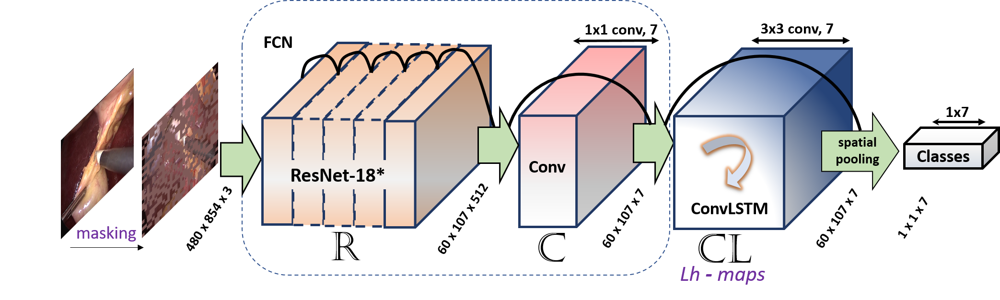
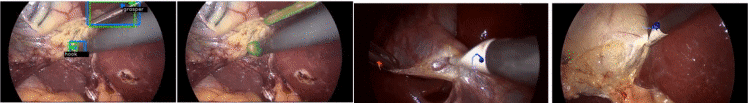

<div align="center">
<a href="http://camma.u-strasbg.fr/">

</a>
</div>

# ConvLSTM Surgical Tool Tracker 
**Weakly Supervised Convolutional LSTM Approach for Tool Tracking in Laparoscopic Videos (IPCAI 2019)**

_CI. Nwoye, D. Mutter, J. Marescaux, N. Padoy_ 


This repository contains the inference demo and evaluation scripts.


[](https://arxiv.org/abs/1812.01366) [](https://colab.research.google.com/github/CAMMA-public/ConvLSTM-Surgical-Tool-Tracker/blob/master/evaluation.ipynb)


# Introduction
    
This model is a re-implementation of the [deep learning tracking model](https://link.springer.com/article/10.1007%2Fs11548-019-01958-6) for surgical tools in Laparoscopic videos using weakly supervised Convolutional LSTM approach. 
The network learns tool detection, localization and tracking from image-level labels. 
The approach is composed of a CNN + Convolutional LSTM (ConvLSTM) neural networks trained end-to-end, but weakly supervised on tool binary presence labels only. We use the ConvLSTM to model the temporal dependencies in the motion of the surgical tools and leverage its spatio-temporal ability to smooth the class peak activations in the localization heat maps (Lh-maps). 
Remarkably, the model learn the spatio-temporal information in time-space domain just from binary presence label using ConvLSTM.
The model achieved a state-of-the-art performance on tool detection, localization and tracking for weakly supervised models.

<div align="center">
  
  <br /><i>Fig. 1: Architecture of the model (R+C+CL variant)</i>
</div>


# Model
There are several variants of the tracker as contained in the paper, but this gitlab repo provides the code for only the R+CL+C variant which can easily be modified to the other variants. (See the published paper)

<b>Code list:</b>
- _model.py_: the model implementation (with all the necessary libs)
- _evaluation.ipynb_: the evaluation and demo script (jupyter notebook)
- _lib_: The model depends on three utility files: _resnet_, _resnet_utils_ and _convlstm_cell_. 
The _convlstm_cell_ is a modified version of the original ConvLSTM library due to bugs in the contrib release. (TensorFlow may likely correct this in future release)
The one-shot state initialization and subsequent between batch state propagation is implemented in the _model.py_ code. 
So, frame seek information (frame index number) is necessary to enforce this continuity in the video data.

The model is trained on the largest public endoscopic video dataset to date: [Cholec80 dataset](http://camma.u-strasbg.fr/datasets).
To reproduce this model on a custom dataset, users can write their training script. 
All the necessary hyperparameters are contained in the published paper and can be tuned to suit your task and dataset.
Model can be trained on sequential frames or video data (with frame-wise binary presence labels)

No data preprocessing is required. 


# Download
If you clone this repo, running the evaluation script will automatically download the model weights (in _ckpt_ directory) and a sample _shortened_ test video (in _data_ directory) for model testing. If you redirect these downloads to a different location, change also their paths in the jupyter notebook's _Variables & Device setup_ section.
Feel free to try on other laparoscopic videos.


# Dependency
The model depends on the following libraries:
1. Tensorflow (1.3 < tf < 2.0)
2. ffmpeg
3. Opencv
4. imageio
5. imageio-ffmpeg
5. matplotlib
6. Python >= 2.7


# System Requirements:
The code has been test on Linux operating system. It runs on both CPU and GPU.
Equivalence of basic OS commands such as _unzip, cd, wget_, etc. will be needed to run in Windows or Mac OS.


# Result
The test results are contained in the published paper. Qualitative results can be found on the CAMMA ICube YouTube channel: [video 1](https://youtu.be/vnMwlS5tvHE)  and [video 2](https://youtu.be/SNhd1yzOe50)

<p align="justify" >
    <a href="https://www.youtube.com/watch?v=vnMwlS5tvHE"></a>
</p>


# Citation
If you use a whole or part of the code, data, model weights or any idea contained herein in your research, please cite this paper:

<p style="margin-left:.5in;text-indent:.-5in;">
    <i>Nwoye, C.I., Mutter, D., Marescaux, J. and Padoy, N., 2019. Weakly supervised convolutional LSTM approach for tool tracking in laparoscopic videos. 
        International journal of computer assisted radiology and surgery, 14(6), pp.1059-1067.</i>
</p>

#### Bibtex:
```bibtex
	@article{nwoye2019weakly,
        title={Weakly supervised convolutional LSTM approach for tool tracking in laparoscopic videos},
        author={Nwoye, Chinedu Innocent and Mutter, Didier and Marescaux, Jacques and Padoy, Nicolas},
        journal={International journal of computer assisted radiology and surgery},
        volume={14},
        number={6},
        pages={1059--1067},
        year={2019},
        publisher={Springer}
        }
```


# License

This code, models, and datasets are available for **non-commercial scientific research purposes** provided by [CC BY-NC-SA 4.0 LICENSE](https://creativecommons.org/licenses/by-nc-sa/4.0/) attached as [LICENSE file](LICENSE). 
By downloading and using this code you agree to the terms in the [LICENSE](LICENSE). Third-party codes are subject to their respective licenses.


<hr/>
<b>This repo is maintained by CAMMA. Comments are welcomed. Check for updates.</b>
